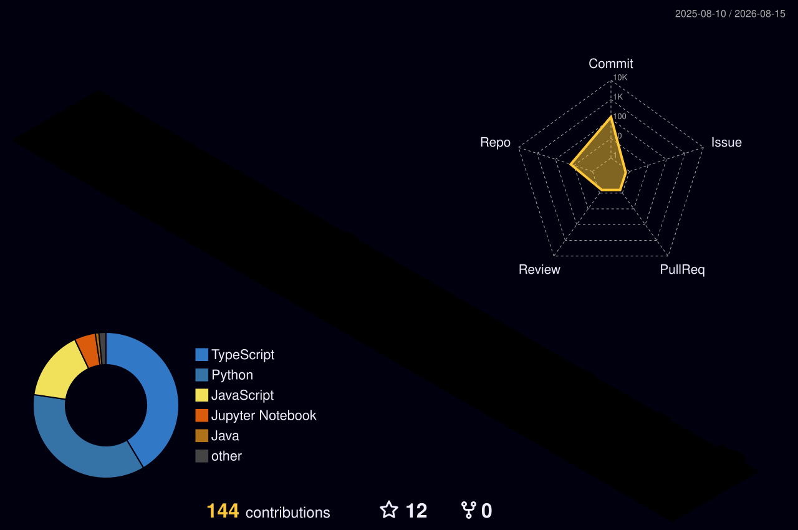

 

&nbsp;

&nbsp;

 

---

## ⚡ Profile Pulse

<table align="center">
<tr>
<td align="center" width="25%">

### 🟢 Building

**Orzyn AI**

Developer Intelligence

</td>

<td align="center" width="25%">

### 🧠 Exploring

**Local AI**

LLMs · RAG · CV

</td>

<td align="center" width="25%">

### 🔧 Learning

**AI Engineering**

MLOps · Fine-tuning

</td>

<td align="center" width="25%">

### 🚀 Mission

**Ship useful software**

Fast · polished · practical

</td>
</tr>
</table>

---

## 🧬 About

I'm **Kenny Richardson**, an AI-focused engineer and product builder who enjoys turning ideas into software that actually works.

My interests sit at the intersection of:

**Artificial Intelligence · Product Engineering · Computer Vision · Full-Stack Development · Developer Tools**

I care about more than making a model produce an output. I like building the system around it, from the interface and APIs to data pipelines, evaluation, deployment, and the occasional battle with a completely unreasonable dependency.

---

## 🚀 Selected Work

<table>
<tr>

<td width="50%" valign="top">

### 🤖 Orzyn AI

**Developer Intelligence Platform**

Analyzing engineering activity, portfolios, and GitHub projects to surface meaningful developer insights.

`React` `TypeScript` `FastAPI` `Python` `GraphQL` `AI`

</td>

<td width="50%" valign="top">

### 🧠 Mnemosyne

**Local Second Brain**

A desktop knowledge system combining semantic search, local embeddings, and personal information retrieval.

`Electron` `React` `TypeScript` `SQLite` `Transformers.js`

</td>

</tr>

<tr>

<td width="50%" valign="top">

### 🪐 Habryn

**Mars Colony Simulation**

An agent-based simulation exploring autonomous colonists, resources, infrastructure, and colony management.

`Python` `Mesa` `NumPy` `Matplotlib`

</td>

<td width="50%" valign="top">

### 💳 Quartly

**Personal Finance Platform**

A polished financial dashboard focused on visualization, interaction, and practical personal finance tracking.

`React` `TypeScript` `Tailwind` `Framer Motion`

</td>

</tr>
</table>

---

## 🛠 Technology

### Languages

  

### AI / Machine Learning

 

`Computer Vision` · `Transformers` · `Hugging Face` · `Embeddings` · `Semantic Search` · `Local LLMs` · `Fine-tuning`

  

### Application Engineering

  

### Data & Infrastructure

 

`LanceDB` · `REST APIs` · `GitHub Actions` · `MLOps`

  

### Deployment

 

`Render` · `GitHub Pages`

---

## 📊 GitHub Activity

  

---

## 🏙️ Contribution Skyline

---

## 📡 Developer Metrics

---

## 🌐 Connect

&nbsp;

&nbsp;

&nbsp;

 

### Building intelligent software, one shipped product at a time.

