 

 

 

<h2>⚡Profile Pulse</h2>

<h1>🧬 About</h1>

I'm Kenny Richardson, an AI-focused engineer and product builder who enjoys turning ideas into software that actually works.

My work sits at the intersection of:

Artificial Intelligence · Product Engineering · Computer Vision · Full-Stack Development · Developer Tools

I like working beyond the model itself: designing interfaces, building APIs, preparing data, evaluating systems, integrating local inference, and turning experiments into usable products.

Currently, I'm especially interested in AI engineering, local LLMs, intelligent developer tools, MLOps, computer vision, and system design.

<h1>🚀 Featured Projects</h1>

<table>

<tr>

<td width="50%" valign="top">

<h2>🤖Orzyn AI</h2>

Developer Intelligence Platform

Turns GitHub repository data into engineering intelligence through repository health analysis, velocity metrics, contributor analysis, risk assessment, forecasting, and AI-generated reports.

Tech:
React TypeScript FastAPI Python GitHub API Cloudflare Workers AI

 

</td>

<td width="50%" valign="top">

💳 Quartly

Personal Finance Platform

A cloud-synced finance application for tracking expenses, analyzing spending patterns, visualizing financial trends, and synchronizing data across devices.

Tech:
React TypeScript Vite Tailwind CSS Firebase Framer Motion

 

</td>

</tr>

<tr>

<td width="50%" valign="top">

🌌 Nyxora

AI Dream Compiler

A long-term AI world-generation project exploring structured knowledge, worldbuilding systems, local language models, memory, retrieval, and generative storytelling.

Tech:
Python LLMs GGUF llama.cpp RAG Structured Data

 

</td>

<td width="50%" valign="top">

🪐 Habryn

Mars Colony Simulation

A modular agent-based Mars colony simulation where astronauts, robots, buildings, resources, managers, logistics, research, maintenance, and emergencies interact inside a living simulation.

Tech:
Python Mesa NumPy Matplotlib Agent-Based Modeling

 

</td>

</tr>

<tr>

<td width="50%" valign="top">

🎬 Boxwit

Reproducible MLOps Pipeline

A focused machine-learning workflow predicting whether movies reach an IMDb rating of 7.0 or higher, built around reproducibility, experiment comparison, validation, model artifacts, and Docker execution.

Tech:
Python Pandas scikit-learn PyYAML Joblib Docker

 

</td>

<td width="50%" valign="top">

🧠 Mnemosyne

Local AI Memory System

A personal AI memory project focused on persistent context, semantic retrieval, local inference, structured memory, and building intelligent systems that can remember.

Tech:
Python SQLite Embeddings Semantic Search Local AI

 

</td>

</tr>

</table>

<h2>🛠 Technology</h2>

<h2>🕹️ Contribution Arcade</h2>

<picture>
  <source
    media="(prefers-color-scheme: dark)"
    srcset="https://raw.githubusercontent.com/kennykrichardson/kennykrichardson/output/galaga-contribution-graph-dark.svg"
  />
  <source
    media="(prefers-color-scheme: light)"
    srcset="https://raw.githubusercontent.com/kennykrichardson/kennykrichardson/output/galaga-contribution-graph.svg"
  />
  
</picture>

<h1>🌐 Connect</h1>

# Thanks for Visiting 🚀

Building intelligent software, one shipped product at a time.

<code>AI/ML · ENGINEERING · DEVELOPMENT · CURIOSITY</code>

